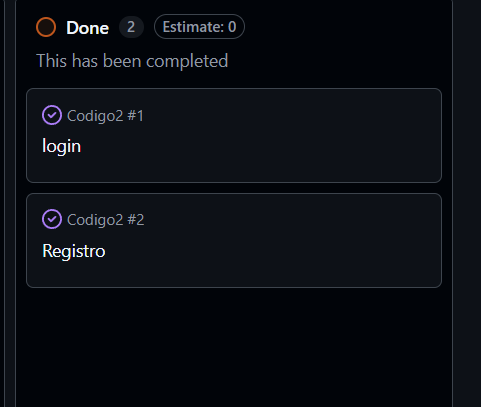
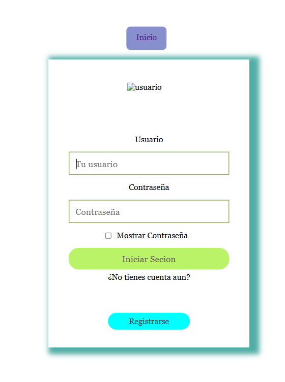
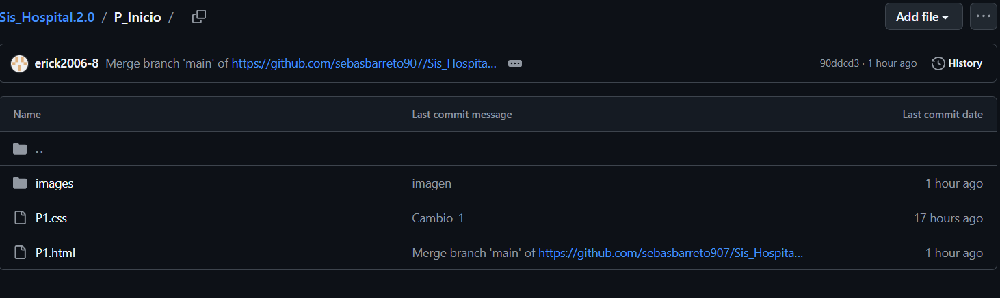

# Issue: Implementación de Login y Registro de Usuarios

## Descripción del Issue

Este issue tiene como objetivo desarrollar e implementar las funcionalidades de autenticación del sistema, permitiendo que los usuarios puedan registrarse e iniciar sesión de manera segura.

La autenticación es un componente fundamental en cualquier aplicación, ya que permite identificar a los usuarios y controlar el acceso a las diferentes funcionalidades del sistema.

## Cómo se realiza

Para completar este issue se llevaron a cabo las siguientes actividades:

1. Creación del formulario de registro de usuarios.
2. Implementación de validaciones para los datos ingresados.
3. Creación del formulario de inicio de sesión.
4. Verificación de credenciales de acceso.
5. Manejo de errores y mensajes de validación.
6. Realización de pruebas para garantizar el correcto funcionamiento del proceso de autenticación.

## Mi aporte

Colaboré con un compañero en el desarrollo de las funcionalidades de **Login** y **Register**, apoyando en:

- Implementación de los formularios de autenticación.
- Validación de datos ingresados por los usuarios.
- Revisión y corrección de errores.
- Pruebas de funcionamiento del inicio de sesión y registro.
- Verificación de que los usuarios puedan crear cuentas e iniciar sesión correctamente.

## Resultado

Se logró implementar correctamente el sistema de autenticación, permitiendo el registro de nuevos usuarios y el acceso mediante credenciales válidas, mejorando la seguridad y funcionalidad de la aplicación.

## Fin de curso

## Background

Durante el desarrollo de este curso adquirí conocimientos sobre el uso de herramientas colaborativas de GitHub, especialmente **Issues** para la gestión y seguimiento de tareas, y **Projects** para la organización y planificación del trabajo en equipo. Como parte de mis aportes, generé un **Issue** relacionado con el desarrollo de la página principal del sistema, definiendo las actividades necesarias para su implementación y seguimiento.

Además, participé en la resolución de problemas dentro de un repositorio compartido, colaborando con mis compañeros en la integración de cambios, corrección de errores, revisión de código y seguimiento de actividades asignadas. Esta experiencia fortaleció mis habilidades de comunicación, organización y trabajo en equipo, aspectos fundamentales en el desarrollo de software.

También reforcé mis conocimientos sobre control de versiones mediante el uso de **commits**, **branches** y **pull requests**, comprendiendo cómo estas herramientas permiten mantener un flujo de trabajo ordenado, facilitar la integración de nuevas funcionalidades y preservar la estabilidad del proyecto.

En general, esta experiencia me permitió adquirir conocimientos prácticos sobre metodologías de desarrollo colaborativo, mejorar mis capacidades para planificar y gestionar tareas, y fortalecer mis competencias técnicas en el desarrollo de aplicaciones web y el trabajo en entornos reales de software.

# Evidencia

